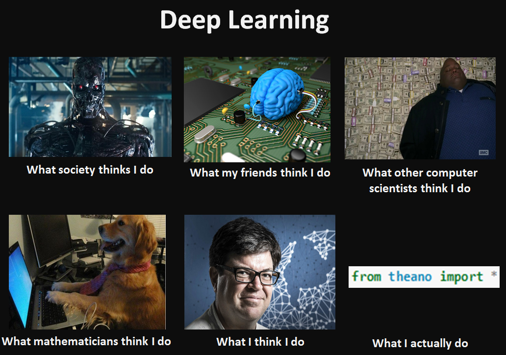

Deep learning is a fast-changing field at the intersection of computer science and mathematics. It is a relatively new branch of a wider field called machine learning. The goal of machine learning is to teach computers to perform various tasks based on the given data. This guide is for those who know some math, know some programming language and now want to dive deep into deep learning.

# Table of Contents
* [Prerequisites](https://github.com/khanhnamle1994/complete-guide-to-deep-learning/tree/master/Prerequisites): You must know standard university-level math and programming to develop and test deep learning models.
* [Machine Learning Basics](https://github.com/khanhnamle1994/complete-guide-to-deep-learning/tree/master/Machine-Learning-Basics): Machine learning is the art and science of teaching computers based on data. It is a relatively established field at the intersection of computer science and mathematics, while deep learning is just a small subfield of it. The concepts and tools of machine learning are important for understanding deep learning.
* [Neural Network Basics](https://github.com/khanhnamle1994/complete-guide-to-deep-learning/tree/master/Neural-Networks-Basics): Neural networks are powerful machine learning algorithms. They form the basis of deep learning.
* [Improving the way neural networks learn](https://github.com/khanhnamle1994/complete-guide-to-deep-learning/tree/master/Improving-How-Neural-Networks-Learn): It's not very easy to train neural networks. Sometimes they don't learn at all (underfitting), sometimes they learn exactly what you give them and their "knowledge" does not generalize to new, unseen data (overfitting). There are many ways to handle these problems.
* [Convolutional neural networks](https://github.com/khanhnamle1994/complete-guide-to-deep-learning/tree/master/Convolutional-Neural-Networks): Convolutional networks ("CNNs") are a special kind of neural nets that use several clever tricks to learn faster and better. ConvNets essentially revolutionized computer vision and are heavily used in speech recognition and text classification as well.
* [Recurrent neural networks](https://github.com/khanhnamle1994/complete-guide-to-deep-learning/tree/master/Recurrent-Neural-Networks): Recurrent networks ("RNNs") are designed to work with sequences. Usually they are used for sentence classification (e.g. sentiment analysis) and speech recognition, but also for text generation and even image generation.
* [Autoencoders](https://github.com/khanhnamle1994/complete-guide-to-deep-learning/tree/master/Autoencoders): Autoencoders are neural networks designed for unsupervised learning, i.e. when the data is not labeled. They can be used for dimension reduction, pretraining of other neural networks, for data generation etc.
* [Probabilistic graphical models](https://github.com/khanhnamle1994/complete-guide-to-deep-learning/tree/master/Probabilistic-Graphical-Models): Probabilistic graphical models (“PGMs”) form a separate subfield at the intersection of statistics and machine learning.
